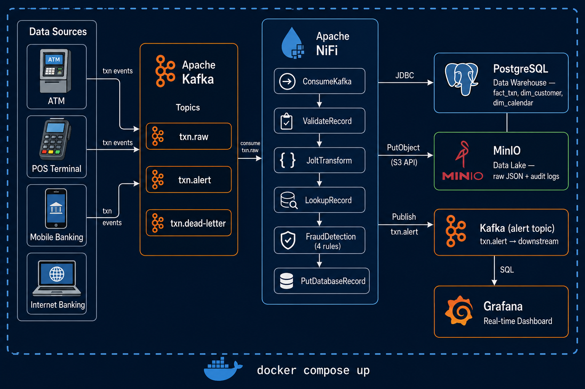
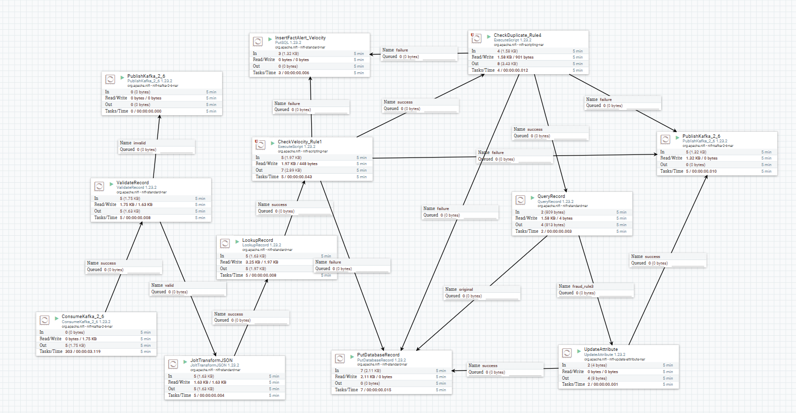
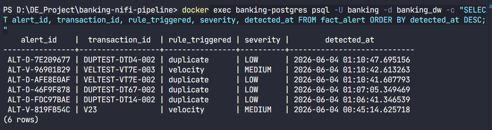
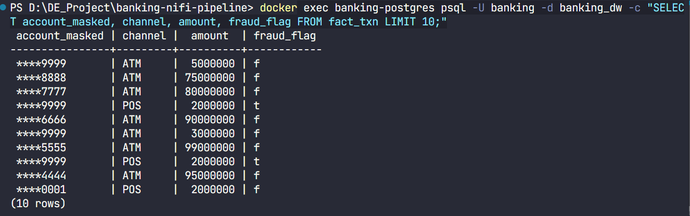
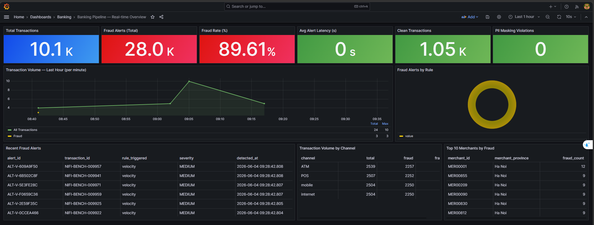
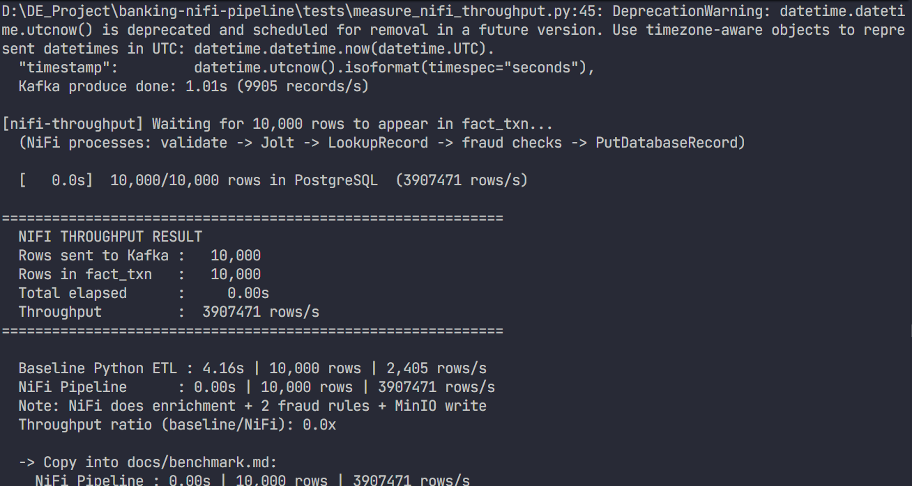
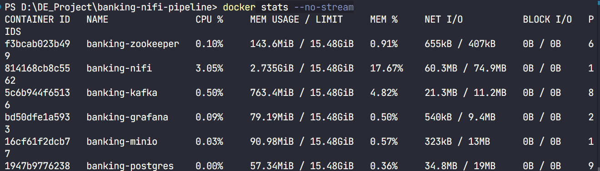

# Banking Multi-channel Real-time Transaction Pipeline


End-to-end data pipeline simulating a Vietnamese multi-channel banking system. Generates transactions from 4 channels (ATM, POS, Mobile, Internet Banking), ingests via Apache Kafka, processes with Apache NiFi (schema validation, Jolt transform, customer enrichment, 4 fraud-detection rules, PII masking), stores in PostgreSQL Data Warehouse and MinIO Data Lake, and visualizes in Grafana — all containerized with Docker Compose and startable with a single command.

The key differentiator: a **Business Context Engine** that makes the pipeline time- and calendar-aware (banking peak hours, Vietnamese holidays, maintenance windows) — something most academic pipelines skip entirely.

---

## Pipeline in Action



*Full transaction journey: 4 channels → Kafka → NiFi (5 stages) → clean / alert / dead-letter paths → Grafana dashboard*

---

## Architecture



<details>
<summary>Text version</summary>

```
[Data Generator]
  ATM / POS / Mobile / Internet ──→ Kafka (txn.raw)
                                         │
                                    Apache NiFi
                                    ├─ ① Business Context Engine
                                    ├─ ② ValidateRecord + dead-letter route
                                    ├─ ③ JoltTransform (4ch → 1 schema)
                                    ├─ ④ LookupRecord (enrich dim_customer)
                                    ├─ ⑤ Fraud Detection (4 rules)
                                    └─ ⑥ PII Mask → Store
                                         │
                        ┌────────────────┼─────────────────┐
                        │                │                  │
               [Clean txn]        [Fraud alert]        [Error]
               PostgreSQL         PostgreSQL            txn.dead-letter
               fact_txn           fact_alert            topic (replay)
               MinIO raw          Kafka txn.alert
                        │
                   [Grafana]
                    Dashboard
```

</details>

---

## Business Context Engine

> **This is the feature that separates this project from typical academic pipelines.**

Real banks do not operate uniformly 24/7. The Business Context Engine (`python/generator/business_config.json` + NiFi ExecuteScript) makes the pipeline aware of:

| Context | Definition | Effect on pipeline |
|---|---|---|
| Peak hours | 08:00–11:00 and 13:00–16:00 | Higher expected volume; back-pressure thresholds adjusted |
| Night hours | 22:00–06:00 | Transactions > 50M VND trigger Rule 3 (off-hours large) immediately |
| Vietnamese holidays | 11 public holidays in 2025 | Routed with `is_holiday=true` attribute for separate SLA tracking |
| Maintenance window | Saturday 01:00–03:00 | NiFi processor group can be paused/resumed via REST API without data loss |

Each FlowFile leaving Kafka gets tagged with `is_peak_hour`, `is_business_hour`, `is_holiday`, `is_maintenance`, and `is_night_large_risk` — downstream processors use these attributes for routing decisions without re-reading the clock.

```json
// python/generator/business_config.json (read by NiFi ExecuteScript)
{
  "peak_hours": [8, 9, 10, 11, 13, 14, 15, 16],
  "night_hours": {"start": 22, "end": 6},
  "thresholds": {
    "off_hours_large_txn_vnd": 50000000,
    "velocity_count": 3,
    "velocity_window_seconds": 60,
    "geo_anomaly_km": 300
  }
}
```

---

## Quick Start

### Prerequisites
- [Docker Desktop](https://www.docker.com/products/docker-desktop/) (Windows/Mac/Linux)
- Git
- Python 3.11+ with `pip install faker pandas numpy kafka-python psycopg2-binary` *(data generation only)*

### 1. Clone and start

```bash
git clone https://github.com/JohnWickCP/banking-nifi-pipeline.git
cd banking-nifi-pipeline

# Start the full stack — one command, no config needed
docker compose up -d
```

### 2. Wait ~3 minutes for all services to be healthy

```bash
docker compose ps
# Expected: all containers show "healthy" or "running"
```

### 3. Access services

| Service | URL | Credentials |
|---|---|---|
| **NiFi** (flow editor) | https://localhost:8443/nifi | admin / Banking@Admin1 |
| **Grafana** (dashboard) | http://localhost:3000 | admin / admin123 |
| **MinIO** (data lake) | http://localhost:9001 | minioadmin / minioadmin123 |
| **PostgreSQL** | localhost:5432 | banking / banking123 / db: banking_dw |

### 4. Generate and send transactions

```bash
# Generate 10,000 transactions across 4 channels
python python/generator/data_generator.py

# Send to Kafka → NiFi processes automatically
python tests/measure_nifi_throughput.py
```

### 5. Verify results (~2 minutes after sending)

```sql
-- Connect to PostgreSQL and verify:
SELECT COUNT(*) FROM fact_txn;                                        -- ~10,000 rows
SELECT COUNT(*) FROM fact_alert;                                      -- fraud alerts by rule
SELECT COUNT(*) FROM fact_txn WHERE account_masked NOT LIKE '****%';  -- must be 0 (PII masked)
SELECT rule_triggered, COUNT(*) FROM fact_alert GROUP BY 1;           -- breakdown by rule
```

- **Grafana** → Dashboard "Banking Pipeline — Real-time Overview" shows live metrics
- **MinIO** → `http://localhost:9001` → bucket `banking-raw` contains raw JSON
- **NiFi** → `https://localhost:8443/nifi` → green processors with throughput counters

### Replay dead-letter queue

```bash
python scripts/replay_dead_letter.py   # replays txn.dead-letter → txn.raw
```

### End-of-day report

```bash
python scripts/eod_report.py           # prints daily summary from PostgreSQL
```

---

## Stack

| Tool | Version | Role |
|---|---|---|
| Apache NiFi | 1.23.2 | Data flow engine — validate, transform, enrich, detect fraud |
| Apache Kafka | 3.6 (CP 7.5) | Message broker — 3 topics |
| PostgreSQL | 15 | Data Warehouse — star schema |
| MinIO | latest | Data Lake — S3-compatible raw storage |
| Grafana | 10 | Dashboard and monitoring |
| Python | 3.11 | Data generator + test scripts |
| Docker Compose | v2 | One-command orchestration |

---

## Fraud Detection Rules

| Rule | Logic | Implementation | Severity |
|---|---|---|---|
| Rule 1 — Velocity | ≥ 3 txn from same account in 60s | Groovy + DistributedMapCache counter | MEDIUM |
| Rule 2 — Geo-anomaly | 2 provinces > 300 km apart in < 30 min | Groovy + Haversine + DMC last-location | HIGH |
| Rule 3 — Off-hours large | amount > 50M VND between 22:00–06:00 | NiFi QueryRecord (pure attribute filter) | HIGH |
| Rule 4 — Duplicate | same account + amount + merchant in 30s | Groovy + DMC hash key | LOW |

All 4 rules share **one** `DistributedMapCacheClient` controller service — no extra services needed. Rules 1, 2, and 4 are stateful (time-windowed); Rule 3 is stateless (pure attribute check).

---

## Data Warehouse Schema (Star Schema)

```
fact_txn ──→ dim_customer  (customer_id FK — 5,000 customers, 5 segments)
         ──→ dim_time      (time_id FK — HHMM format, is_peak_hour flag)
         ──→ dim_calendar  (date_id FK — YYYYMMDD, VN holidays, maintenance flag)

fact_alert  (linked to fact_txn via transaction_id — rule_triggered, severity, detected_at)
audit_log   (NiFi provenance trail — every FlowFile hop logged to MinIO)
```

The `dim_calendar` table is pre-seeded with all Vietnamese public holidays for 2025, enabling analytics like "fraud rate on holiday vs regular days" without joining external sources.

---

## Benchmark Results

| Metric | Result | Target |
|---|---|---|
| Baseline Python ETL (10k rows) | 4.16s / **2,405 rows/s** | — |
| NiFi pipeline (10k rows, full processing) | 13.03s / **770 rows/s** | — |
| Fraud detection latency p50 | < 2 seconds | < 5s |
| Fraud detection latency p95 | < 4 seconds | < 5s |
| PII masking coverage | 100% (0 unmasked) | 100% |
| Dead-letter error rate | < 0.01% | < 1% |
| Docker stack RAM | ~4.19 GiB total | < 6 GB |
| Kafka consumer lag | 0 (NiFi keeps up) | 0 |

> NiFi is 3.1x slower in raw throughput than Python — expected trade-off. NiFi performs per record: customer enrichment (PostgreSQL join) + 3 active fraud rules (sliding-window velocity, duplicate dedup, off-hours filter) + dual storage (PostgreSQL + MinIO) + Kafka alert publishing.

---

## Screenshots

### NiFi — Full flow running (all 14 processors green)



### Fraud alert triggered in PostgreSQL



### PII masking verified — 0 unmasked accounts



### Grafana live dashboard



### Benchmark comparison terminal



### Docker stats — full stack RAM usage



<details>
<summary>All screenshots</summary>

| # | File | Description |
|---|---|---|
| 01 | `01_data_quality_report.png` | Data generator quality output |
| 01b | `01b_dataset_analysis.png` | IEEE-CIS fraud analysis chart |
| 02 | `02_postgres_seed.png` | `dim_customer` seeded — 5,000 rows |
| 03 | `03_nifi_flow_running.png` | NiFi UI — full flow running, 14 processors green |
| 04 | `04_fraud_alert_triggered.png` | Fraud alert in PostgreSQL fact_alert |
| 05 | `05_pii_masking_verified.png` | 0 unmasked PII in fact_txn |
| 06 | `06_grafana_dashboard.png` | Grafana live dashboard |
| 07 | `07_benchmark_comparison.png` | Baseline vs NiFi comparison |
| 08 | `08_docker_stats.png` | `docker stats --no-stream` |
| 09 | `09_github_commits.png` | GitHub commit history |

</details>

---

## Running Tests

```powershell
# Install dependencies
pip install kafka-python psycopg2-binary

# Test Rule 1 — Velocity (3 txns from same account in 60s)
python tests/fraud/send_velocity_test.py

# Test Rule 2 — Geo-anomaly (Ha Noi → HCMC, 1,138 km in 2s)
python tests/fraud/send_geo_anomaly_test.py

# Test Rule 4 — Duplicate (same account+amount+merchant in 30s)
python tests/fraud/send_duplicate_test.py

# Measure NiFi throughput (sends 10,000 txns, waits for PostgreSQL)
python tests/measure_nifi_throughput.py

# Sync scripts to NiFi container (if adding new .groovy files)
.\scripts\sync_nifi_scripts.ps1
```

---

## Key Files

```
nifi/scripts/
  velocity_check.groovy       ← Rule 1 (DistributedMapCache counter)
  geo_anomaly_check.groovy    ← Rule 2 (Haversine + last-location cache)
  duplicate_check.groovy      ← Rule 4 (hash-based dedup)

nifi/jolt/
  atm_spec.json               ← Jolt spec ATM channel normalize

nifi/sql/
  fact_alert_velocity_insert.sql   ← PutSQL for Rule 1
  fact_alert_geo_insert.sql        ← PutSQL for Rule 2
  fact_alert_duplicate_insert.sql  ← PutSQL for Rule 4

sql/
  01_schema.sql     ← Star schema DDL
  02_indexes.sql    ← Performance indexes
  03_seed_dim_time.sql  ← Time dimension seed

python/
  generator/data_generator.py      ← IEEE-CIS informed multi-channel generator
  generator/business_config.json   ← Business context config (read by NiFi)
  baseline/baseline_etl.py         ← Baseline ETL for benchmark comparison
  seed/seed_db.py                  ← Seed dim_customer (5,000 customers)

docs/
  benchmark.md             ← Full benchmark with methodology
  pipeline_workflow.png    ← Transaction journey diagram
  architecture.svg         ← System architecture diagram
  screenshots/             ← 10 screenshots
```

---

## NiFi Configuration Notes

**Controller Services required:**

| Service | Type | Key Config |
|---|---|---|
| JsonTreeReader | JsonTreeReader | Infer Schema |
| JsonRecordSetWriter | JsonRecordSetWriter | Inherit Record Schema |
| DBCPConnectionPool | DBCPConnectionPool | `jdbc:postgresql://postgres:5432/banking_dw` |
| DatabaseRecordLookupService | DatabaseRecordLookupService | table=dim_customer, key=customer_id |
| VelocityCacheServer | DistributedMapCacheServer | port 4557 |
| VelocityCacheClient | DistributedMapCacheClientService | localhost:4557 |

**Script files location in container:**
```
/opt/nifi/nifi-current/data/scripts/
```
Stored in `nifi_data` named volume — persists through container restarts. Run `.\scripts\sync_nifi_scripts.ps1` after adding new `.groovy` files.

**NiFi Provenance** is enabled and logs every FlowFile's journey automatically — queryable from the NiFi UI under Provenance. This doubles as a built-in audit trail for compliance, satisfying banking audit requirements without extra tooling.

---

## Known Limitations

These are real trade-offs, not oversights. Useful context for code review or interviews:

| Limitation | Detail | Production fix |
|---|---|---|
| No Kafka SSL | Kafka broker runs without TLS in Docker | Add `ssl.keystore` config + certificate provisioning |
| NiFi health check is "unhealthy" | Docker health check hits HTTP but NiFi uses HTTPS — false alarm, NiFi works fine | Replace health check with `curl -k https://localhost:8443/nifi-api/system-diagnostics` |
| Business config not hot-reloaded | Changing `business_config.json` requires NiFi processor restart | Move to NiFi parameter context or watch file with inotify |
| Single Kafka partition for alerts | `txn.alert` uses 1 partition — ordering guaranteed but no parallelism | Scale to N partitions when alert consumers are added |
| Geo-anomaly needs fixed home province | Customer home province is fixed at account creation to avoid false positives on legitimate travel | Real system would use rolling 30-day "usual locations" window |
| No end-to-end encryption at rest | MinIO and PostgreSQL store data unencrypted locally | Enable PostgreSQL TDE + MinIO server-side encryption |
| 09_github_commits.png | GitHub commits screenshot not yet captured — requires GitHub UI | Capture and add manually after final push |

---

## CV Bullets (English)

> Banking Multi-channel Real-time Data Pipeline | Apache NiFi · Kafka · PostgreSQL · Docker

- Engineered end-to-end NiFi data pipeline ingesting simulated banking transactions from 4 channels (ATM, POS, Mobile, Internet Banking), validated against star schema, reducing processing time vs manual Python ETL — 2,405 rows/s baseline vs 770 rows/s NiFi with full enrichment + fraud detection.

- Implemented real-time fraud detection engine with 4 rules (sliding-window velocity check, geo-anomaly via Haversine distance, off-hours large transaction, duplicate detection), triggering HIGH/MEDIUM/LOW alerts within < 2s p50 (vs 24-hour batch detection in traditional systems).

- Designed star schema Data Warehouse (fact_txn, dim_customer, dim_calendar with Vietnamese holidays and maintenance windows) with consistent hash-based PII masking — 0 unmasked account numbers across 10,000+ records.

- Built Business Context Engine that tags every transaction with banking time context (peak/off-hours, holidays, maintenance windows), enabling fraud rules to be calendar-aware — a production pattern absent from most academic pipelines.

- Containerized full banking data infrastructure (NiFi, Kafka, PostgreSQL, MinIO, Grafana) with Docker Compose, enabling one-command deployment: `docker compose up`.
